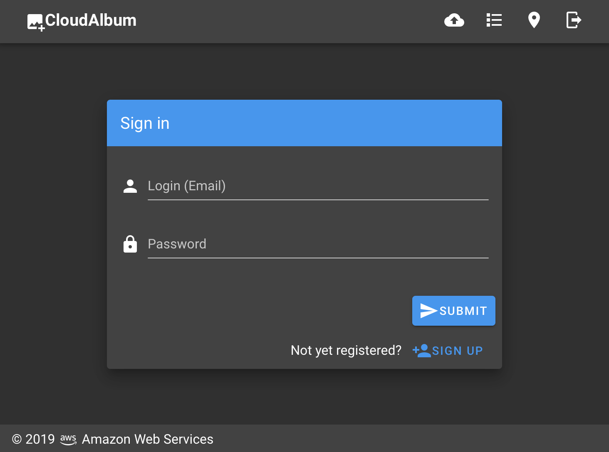
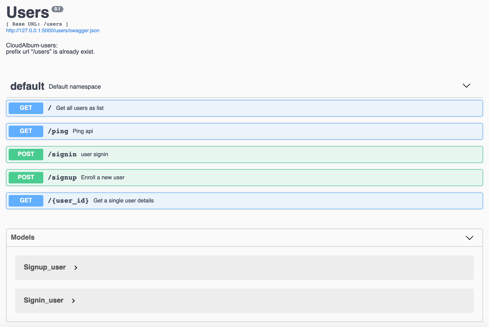
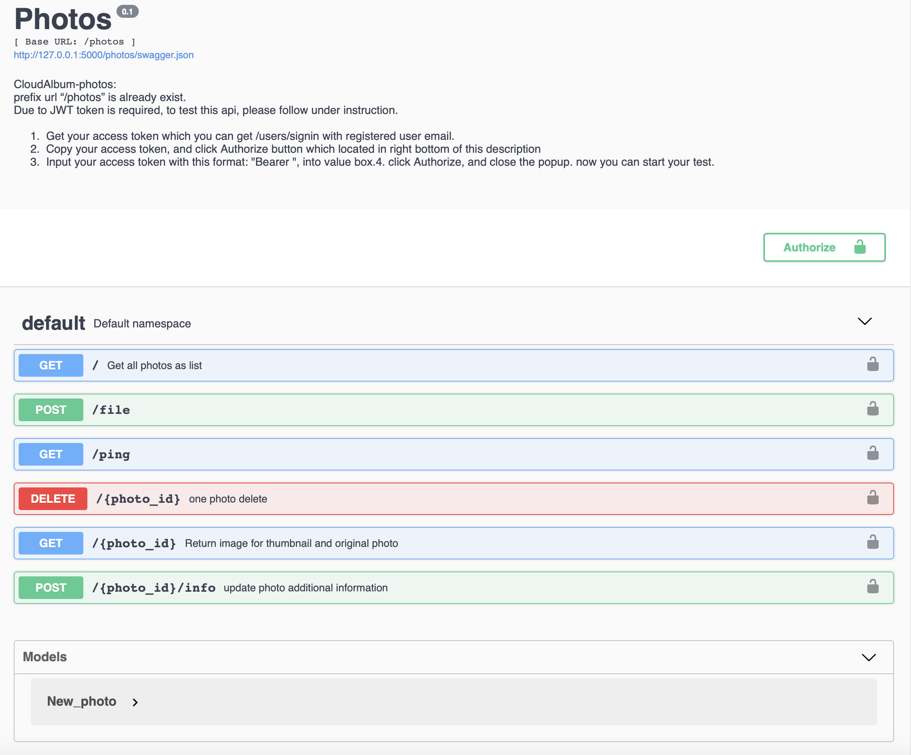
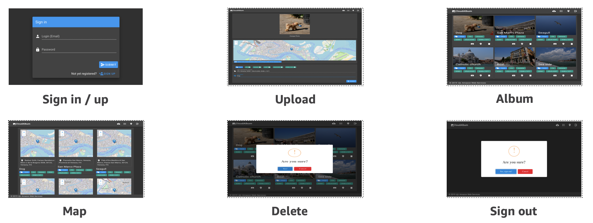

# LAB 01 - Take a look around

In this hands-on lab, you'll configure the **AWS [Cloud9](https://aws.amazon.com/cloud9/)** service to look around legacy application. You can run application 'CloudAlbum' in the AWS Cloud9 EC2 instance.

**GoGreen** company provides a hosted photo image album services (CloudAlbum) to it's end user. Customer access the web application to :

* To watch their personal photos with internet access.
* Upload photos to the CloudAlbum service for photo management.
* Track geolocation of uploaded photos


**CloudAlbum** has a general three-tier architecture.


The application has following software stack.

* Front-end
  * Vue.js : A progressive framework for building user interfaces. 
  * Vuetify : A Material Design component framework for Vue.js
  * Axios : Promise based HTTP client for the browser and node.js 
  * Leaflet : A JavaScript library for interactive maps
  * exif.js : A JavaScript library for reading EXIF meta data from image files.
  * SweetAlert2 : A beautiful, responsive, customizable and accessible (WAI-ARIA) replacement for JavaScript's popup boxes.

* Back-end
  * Flask : A lightweight WSGI web application framework. 
  * Flask-RESTPlus : An extension for Flask that adds support for quickly building REST APIs.
  * SQLAlchemy : The Python SQL Toolkit and Object Relational Mapper.
  * Pillow : Python Imaging Library (Fork)


It has following several features.


## Prerequisites
The following **prerequisited** are required for the workshop:

* AWS Console Access.
* AWS CLI configured EC2 or PC. (`AdministratorAccess` recommended)


## TASK 1. Create AWS Cloud9 environment and explore the environment.

In this section, you will create an AWS Cloud9 environment and explore the environment.

1. In the AWS Console, click **Services**, then click **Cloud9** to open the Cloud9 dashboard.

2. You can choose **Singapore(ap-southeast-1)** region.

3. Click **Create environment** at the top-right corner.

4. For **Name**, type **workshop-\<INITIAL\>** (**keep in mind** this, it will be reused.)

5. Click **Next step.**

6. On the **Configure settings** page, leave the default selection in the Environment settings section. (Default instance type is t2.micro.)

7. Click Next step.

8. Review the details and click **Create environment**. This should launch your AWS Cloud9 environment in a few minutes.

9. Upon environment creation, notice the **terminal window on the bottom pane**. The terminal provides a remote login to the instance on which the AWS Cloud9 environment is hosted, just as you used SSH for remote login. A **pre-authenticated AWS CLI** is installed in your terminal.

10. Cloud9 instance already has basic development tools as well as AWS CLI. Explore the terminal by typing this command: 

```console
aws ec2 describe-instances
``` 
* Is it works well? Cool. Go to next step.

11. Now setup python environment.
* We can also use **virtualenv** for our project. (Please refer following links. In this LAB doesn't use **virtualenv** for the convinience.)


```console
which python3
```
* You can check python3 version.
```console
python3 --version
```
* Then you can setup `virtualenv`
```console
python3 -m venv venv
source venv/bin/activate
```
* However, in the Cloud9 terminal environment, `python` command is aliased, so `python --version` or `which python` will show 'python27'. So, we need to run `unalias python`. Now you can see right version and right path like below.

* For later use, run following command.
```console
unalias python
echo "unalias python" >> ~/.bash_profile
echo "source ~/environment/venv/bin/activate" >> ~/.bash_profile
```


```console
which python
~/environment/venv/bin/python
python --version
Python 3.6.8
```

Now, you can see `(venv) $ ` prompt then install `boto3` library.
```console
python --version
pip install boto3
```

12. At the terminal, type **python** and press ENTER.

13. For the confirmination, try the Python Boto 3 APIs by executing these commands:


```python
import boto3
client = boto3.client('ec2')
client.describe_instances()
```


14. If it works well, we can start now. Press **CTRL+D** to exit the Python interpreter.

**NOTE :** You can also refer following links. 

* https://docs.aws.amazon.com/ko_kr/cloud9/latest/user-guide/sample-python.html#sample-python-install
 
* https://docs.aws.amazon.com/ko_kr/cloud9/latest/user-guide/sample-python.html#sample-python-run


## TASK 2. Look around current application and try run it.

15. Check out the workshop repository from the Github.

```console
cd ~/environment
```
```console
git clone https://github.com/aws-kr-tnc/moving-to-serverless-renew --depth 1
```


16. Now take a look at the frontend application. (~environment/moving-to-serverless-renew/LAB01/frontend/cloudalbum/src)
  


17. Install the requirements for the project by executing the command below in your AWS Cloud9 terminal.

```console
cd ~/environment/moving-to-serverless-renew/LAB01/frontend/cloudalbum
npm install -g vue-cli
npm install
```

18. Frontend application do api call, so we have to define destination backend address. You can check this `.env` file below.
```console
~environment/moving-to-serverless-renew/LAB01/frontend/cloudalbum/.env
```
* It contains below default properties.
```console
//AXIOS api request time-out
VUE_APP_TIMEOUT=15000

//For test/development 
VUE_APP_API=http://127.0.0.1:5000

//For deployment 
//VUE_APP_API=http://<DEPLOYED_SERVER>

```

19. Let's take a look around backend application. (~environment/moving-to-serverless-renew/LAB01/backend)

  


20. Install the requirements for the project by executing the command below in your AWS Cloud9 terminal.

```console
pip install -r ~/environment/moving-to-serverless-renew/LAB01/backend/requirements.txt
```

21. Check the **config.py** Open this file in **Cloud9 IDE editor**. (`~/environment/moving-to-serverless-renew/LAB01/backend/cloudalbum/config.py`)

* You can find the configuration information you need when this application is run.


```python
import os
import datetime


class BaseConfig:
    """Base configuration"""
    TESTING = False
    APP_HOST = os.getenv('APP_HOST', '0.0.0.0')
    APP_PORT = os.getenv('APP_PORT', 8080)

    SECRET_KEY = os.getenv('FLASK_SECRET', os.urandom(24))
    JWT_SECRET_KEY = os.getenv('JWT_SECRET_KEY', 'my_jwt')
    JWT_ACCESS_TOKEN_EXPIRES = os.getenv('JWT_ACCESS_TOKEN_EXPIRES', datetime.timedelta(days=1))
    JWT_BLACKLIST_ENABLED = os.getenv('JWT_BLACKLIST_ENABLED', True)
    JWT_BLACKLIST_TOKEN_CHECKS = ['access']

    SQLALCHEMY_TRACK_MODIFICATIONS = False
    SQLALCHEMY_ECHO_FLAG = os.getenv('SQLALCHEMY_ECHO_FLAG', True)

    UPLOAD_FOLDER = os.getenv('UPLOAD_FOLDER', os.path.join(os.getcwd(), 'upload'))
    THUMBNAIL_WIDTH = os.getenv('THUMBNAIL_WIDTH', 300)
    THUMBNAIL_HEIGHT = os.getenv('THUMBNAIL_HEIGHT', 200)


class DevelopmentConfig(BaseConfig):
    """Development configuration"""
    SQLALCHEMY_DATABASE_URI = os.getenv('DATABASE_URL', database)


class TestingConfig(BaseConfig):
    """Testing configuration"""
    TESTING = True
    SQLALCHEMY_DATABASE_URI = os.getenv('DATABASE_TEST_URL', database)


class ProductionConfig(BaseConfig):
    """Production configuration"""
    SQLALCHEMY_DATABASE_URI = os.environ.get('DATABASE_URL')

```

* The second parameter of **os.getenv** function is the default value to use when the **first parameter does not exist.**


22. Now, let's run back-end application server. To run the back-end application server we will use a Cloud9 terminal. 

* For reference, you can also use Cloud9 Custom Runner. To use Custom Runner provided by Cloud9, you can refer to the following document.  
  * https://docs.aws.amazon.com/cloud9/latest/user-guide/build-run-debug.html#build-run-debug-change-runner 

* First, set up environment variables.
```console
export FLASK_ENV=development
export APP_SETTINGS=cloudalbum.config.DevelopmentConfig
export UPLOAD_FOLDER=/tmp
```
* Or, `source shell.env`

* Then, run following command.
```
cd ~/environment/moving-to-serverless-renew/LAB01/backend
python manage.py run -h 0.0.0.0 -p 5000
```

* And now, you can see the following messages on your terminal.
	
```console
[2019-08-21 06:30:13,866] INFO in manage: SQLALCHEMY_DATABASE_URI: sqlite:////tmp/sqlite_dev.db
SQLALCHEMY_DATABASE_URI: sqlite:////tmp/sqlite_dev.db
[2019-08-21 06:30:13,866] INFO in manage: UPLOAD_FOLDER: /tmp
UPLOAD_FOLDER: /tmp
 * Environment: development
 * Debug mode: on
 * Running on http://0.0.0.0:5000/ (Press CTRL+C to quit)
 * Restarting with stat
[2019-08-21 06:30:14,383] INFO in manage: SQLALCHEMY_DATABASE_URI: sqlite:////tmp/sqlite_dev.db
SQLALCHEMY_DATABASE_URI: sqlite:////tmp/sqlite_dev.db
[2019-08-21 06:30:14,384] INFO in manage: UPLOAD_FOLDER: /tmp
UPLOAD_FOLDER: /tmp
 * Debugger is active!
 * Debugger PIN: 171-963-592
```

23. Let's call a simple api to check if the back-end application ran successfully. We'll use httpie to test it.

```console
http localhost:5000/users/ping
```
* Now you can see similar messages below.

```console
(venv) lachesis:~/environment $ http localhost:5000/users/ping
HTTP/1.0 200 OK
Access-Control-Allow-Origin: *
Content-Length: 56
Content-Type: application/json
Date: Wed, 21 Aug 2019 06:37:20 GMT
Server: Werkzeug/0.15.5 Python/3.6.8

{
    "Message": {
        "msg": "pong!"
    },
    "ok": true
}

```


24. Now, let's run front-end application server. To run the front-end application we need to run front-end application server.

```console
npm run serve
```

* And then you can see similar messages below.

```console
...
Use Ctrl+C to close it

  App running at:
  - Local:   http://localhost:8080/ 
  - Network: http://172.31.4.231:8080/

  Note that the development build is not optimized.
  To create a production build, run npm run build.

```


## TASK 3 Connect to your application (Via SSH Tunneling)

Cloud9 has preview feature to support yout application development.
 * You can refer following document : https://docs.aws.amazon.com/cloud9/latest/user-guide/app-preview.html

for convenience, we will use **SSH tunnel** to access our application in Cloud9 instance.

25. Add your public key to `.ssh/authorized_keys`.


* In your MAC/Linux terminal, type the command below to get the public portion from **your existing any key pair .pem** file. Make sure to replace YOUR_KEY with the name of the key pair .pem file

```console
ssh-keygen -f <YOUR_KEY.pem> -y
```

* The output looks like the example below. Copy the output of your command.
```console
ssh-rsa
ASDASDASDASDAyc2EAAAADAQABAAABAQDWGRZsPraV6v4UqfZTFKAXK9bhjWVkONEKyAA1CeOkxSN+9WdY7gKgjbPOeUx3LFqRudBvSrP+eKTtthPrl Nx9UBvXniVK252i4h0xnIcrRO1PUpq0EzyqX+n3u2YwytT+on6x98PRjtD4oCKyfFviWBqnRHtWvRre8CWhULuJrmUeo2aPrVTPXo/TwJpZupXv63YyUMPC 2wyDMDsKNZhsqUedkJ8575PGXCg9gEkPg2ulR8NUrzDSfbXIrZLgCcIziwDQ0dA9B28OAQ9saPyXYzrZF1ZmCxKgzSHHiKdBAJ0E/X/s53N5Hg04SIWy4D4lMT 9g+AZG38YPNq68mo4b
```

* In your AWS Cloud9 instance, on the left pane, click the **Settings** icon. Click **Show Home in Favorites** and **Show Hidden Files** as shown in the screenshot below.


* This should display the `.ssh` folder in the tree view.

* Expand the .ssh folder and open the **authorized_keys** file.

* Paste the public key you copied earlier in the authorized_keys file. **Important:** Make sure to paste the public key below the message in the authorized_keys file as shown below. **Do not delete or overwrite** the public key already present in the file. Deleting or overwriting the existing public key will make your Cloud9 instance unusable.

```console
...
...
 #
 # Add any additional keys below this line
 #
```
* Save the **authorized_keys** file. By updating this file, you are telling your AWS Cloud9 instance to allow connections that authenticate with the matching private key.

**NOTE:** You also can paste it using cli command like below. (Paste public key then press CTRL+D for EOF)

```console
cat >> ~/.ssh/authorized_keys
ssh-rsa CXCAAB3Nzaxxyc2EAAAADAQABAAABAQDThHERqJJMcZqitA5DZ35j41UFE0zIO5XxVqElCHNHUXYnmffqFNyTFkfpkHAWsR5zGMnR5I46eZazu4sWNcg3LZx937/STOfN4TCzps/uuooHx/p3whGXIFqsz25Xq1RzI/LsFiSRm3+/I1E482pss3OgCXALR/rF9g7Mud1frt9POq82Zg0R1YHB5hCK6Ldx3U3AnFxdViKHVnDgVijAYO+ua1MFtaSn+FqYoXbMniFiQpOJz2ZTvM/ZhwvfAYJkJPYwQ+7T99pIEb0L/pLecaFkxUcbAiwzW6L79bKAQYwA7vEzI4ndqhyLKwIzadVJnog1hRs0ItiUqDOSLYLN sungshik@8c85904c36cf.ant.amazon.com

```

26. Open TCP port 22 of Cloud9 instance to your current public IP.

* Check the public IP address you are using now. You can access following site to get current public IP.
  * https://checkip.amazonaws.com/ 

  

* Keep your IP address for later use. Now, open your new terminal in the Cloud9.

  

* Run, below command. To add new ingress Security Group rule for SSH connection.
```console
SG_NAME=`curl -s http://169.254.169.254/latest/meta-data/security-groups`
SG_ID=`aws ec2 describe-security-groups --group-names $SG_NAME --query 'SecurityGroups[*].[GroupId]' --output text`
```

* Before run below command, you should replace  `<YOUR_IP>` like `61.79.225.xxx`.
```console
aws ec2 authorize-security-group-ingress \
--group-id $SG_ID \
--protocol tcp \
--port 22 \
--cidr <YOUR_IP>/32

```

* You can check the result via below command. (61.79.xxx.xxx/32)
```console
aws ec2 describe-security-groups --group-ids $SG_ID --query "SecurityGroups[].IpPermissions[].IpRanges"
[
    [
        {
            "CidrIp": "13.250.xxx.xxx/27"
        }, 
        {
            "CidrIp": "13.250.xxx.xxx/27"
        }, 
        {
            "CidrIp": "61.79.xxx.xxx/32"
        }
    ]
]
```


27. Make a SSH connection with tunneling.

* Let's get public IP of Cloud9. Try below command 
in your Cloud9 terminal and keep the IP. 
```console
ec2-metadata -v
public-ipv4: 54.169.xxx.xxx
```

* Try to SSH tunneling like this

* **NOTE:** Make sure **your Cloud9 instance Security group port 22** is opened for SSH tunneling.

```console
ssh -i <YOUR_KEY.pem> -L 8080:localhost:8080 -L 5000:localhost:5000 ec2-user@<CLOUD9 PUBLIC-IP>
```


28. Connect your application


## TASK 4. Take a look around
Now everything is ready. Let's access the application.

29. Connect to your front-end application using your browser.
 * http://localhost:8080/



30. Our backend application support SWAGGER. Now you can see SWAGGER interface of backend application.

* Swagger is an open-source software framework backed by a large ecosystem of tools that helps developers design, build, document, and consume RESTful Web services. Swagger also allows you to understand and test your backend api specifically.

  * User API : http://localhost:5000/users/swagger/


  * Photo API : http://localhost:5000/photos/swagger/



31. Take a look around and perform test.


* Sign in / up
* Upload Sample Photos
* **Download sample images here** (EXIF data included) 
  *  https://d2r3btx883i63b.cloudfront.net/temp/sample-photo.zip
* Look your Album
* Find photos with Search tool
* Check the Photo Map


## TASK 5. Stop your application 
* You can stop both frontend and backend application by press `ctrl+c` in your Cloud9 Terminal.

# Congratulation! You completed LAB01.

## LAB GUIDE LINKS
* [LAB 01 - Take a look around](LAB01.md)
* [LAB 02 - Building and deploying your application in HA environment](LAB02.md)
* [LAB 03 - Moving to AWS serverless](LAB03.md)
* [LAB 04 - Serverless with AWS Chalice](LAB04.md)
