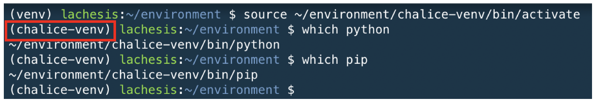

# LAB 04 - Serverless with AWS Chalice
This exercise is divided into two parts. The first part is about the AWS serverless framework Chalice, and the second part is using the Chalice to run the CloudAlbum application.

## Serverless framework
There are various serverless frameworks. Here is a brief introduction to each of the serverless frameworks.

### AWS Chalice
***Chalice*** is a microframework(https://github.com/aws/chalice) for writing serverless apps in python. It makes it simple for you to use AWS Lambda and Amazon API Gateway to build serverless apps. It allows you to quickly create and deploy applications that use AWS Lambda. It provides:

* A command line tool for creating, deploying, and managing your app
* A decorator based API for integrating with Amazon API Gateway, Amazon S3, Amazon SNS, Amazon SQS, and other AWS services.
* Automatic IAM policy generation

* References
  * Official document: https://buildmedia.readthedocs.org/media/pdf/chalice/latest/chalice.pdf
  * AWS Chalice workshop: https://chalice-workshop.readthedocs.io/en/latest/
  * Github repo: https://github.com/aws/chalice

### Serverless 
The ***Serverless*** Framework (https://serverless.com) is an MIT open source framework that’s actively developed and maintained by a full-time team. At its essence, it allows users to define a serverless application—including Lambda functions and API Gateway APIs—and then deploy it using a command-line interface (CLI). It helps you organize and structure serverless applications, which is of great benefit as you begin to build larger systems, and it’s fully extensible via its plugin system.

### Zappa
***Zappa*** (https://github.com/Miserlou/Zappa) makes it super easy to build and deploy server-less, event-driven Python applications (including, but not limited to, WSGI web apps) on AWS Lambda + API Gateway. Think of it as "serverless" web hosting for your Python apps. That means infinite scaling, zero downtime, zero maintenance - and at a fraction of the cost of your current deployments!


### APEX
***Apex*** (https://apex.run/)lets you build, deploy, and manage AWS Lambda functions with ease. With Apex you can use languages that are not natively supported by AWS Lambda, such as Golang, through the use of a Node.js shim injected into the build. A variety of workflow related tooling is provided for testing functions, rolling back deploys, viewing metrics, tailing logs, hooking into the build system and more. 


**NOTE:** These ***serverless frameworks*** have many similarities. You can choose one framework from the above. In this hands-on lab, **you will use AWS Chalice**.

## TASK 1 : Setup virtualenv
***virtualenv*** is a tool to create isolated Python environments. It is easy to use. We will create virtualenv for AWS Chalice microframework environment.

* **We alrady set up virtualenv LAB0 01 - TASK 1**
  * You can refer detailed instructions in `LAB0 01 - TASK 1`

1. Make virtualenv for chalice application.

```console
cd ~/environment
python3 -m venv chalice-venv
```

2. Activate your **virtualenv** (`chalice-venv`).
```Console
source ~/environment/chalice-venv/bin/activate
which python
which pip
```



3. Install AWS Chalice microframework (Of course, you must run following command after ***venv*** activation)
```Console
pip install chalice
```

```console
chalice --version
```
* output:
```
chalice 1.10.0, python 3.6.8, linux 4.14.133-88.112.amzn1.x86_64
```

4. Install required packages for this lab. 

```Console
pip install -r ~/environment/moving-to-serverless-workshop-1d/LAB04/02-CloudAlbum-Chalice/cloudalbum/requirements.txt
```

## TASK 2 : Build a simple AWS Chalice serverless app.
This TASK will provide an introduction on how to use AWS Chalice and provide instructions on how to go about building your very first Chalice application. 

5. We installed AWS Chalice serverless framework previous step, it is time to create your first Chalice application. Run the ***chalice new-project*** command to create a project called ***myapp***:

```console
mkdir -p ~/environment/moving-to-serverless-renew/LAB04/01-Chalice/
```
```console
cd ~/environment/moving-to-serverless-renew/LAB04/01-Chalice/
```
```console
chalice new-project myapp
```

6. Review the generated files which generated by Chalice framework.
```
sudo yum install tree
```
```
tree -a .
```
* output: 
```
<username>:~/environment/moving-to-serverless-workshop-1d/LAB04/01-Chalice (master) $ tree -a .

.
└── myapp
    ├── app.py
    ├── .chalice
    │   └── config.json
    ├── .gitignore
    └── requirements.txt

```
* You can find above files after run `chalice new-project myapp` command. 

```
cd myapp
```
```
vi app.py (or use open int the Cloud9 default editor)
```
```python
from chalice import Chalice

app = Chalice(app_name='myapp')


@app.route('/')
def index():
    return {'hello': 'world'}

```
* It looks very similar to the **Flask** framework. 

7. Run Chalice application as a local application in your machine.
```
chalice local --port 8080
```
You can see the following message: ***Serving on 127.0.0.1:8080***
if you want detailed execution information, you can also run Chalice as debug mode ***chalice --debug local --port 8080***

For the convenience of test, we will use ***httpie*** in the shell. 

* You can open **NEW TERMINAL** with bash shell and then type following command.


```console
pip install httpie
```

* After ***httpie*** is installed as ***http*** command, you can run following command for the application test. 
```
http localhost:8080/
```
* output:
```
HTTP/1.1 200 OK
Content-Length: 18
Content-Type: application/json
Date: Sun, 05 Aug 2018 07:02:01 GMT
Server: BaseHTTP/0.6 Python/3.6.5

{
    "hello": "world"
}

```

8. To help your understanding, consider the following example.
```python
from chalice import Chalice
from chalice import Response 
import logging

app = Chalice(app_name='myapp')
app.debug = True
app.log.setLevel(logging.DEBUG)


@app.route('/')
def index():
    return {'hello': 'world'}


@app.route('/users/{name}', methods=['GET'])
def user_info(name):
    request=app.current_request
    app.log.debug(request.method)
    app.log.debug(request.to_dict())
    body='<h1> Your name is {0}.</h1>'.format(name)

    return Response(body=body,
        status_code=200,
        headers={'Content-Type': 'text/html; charset=utf-8'})


@app.route('/users', methods=['POST'])
def user_add():
    request = app.current_request
    app.log.debug(request.method)
    app.log.debug(request.to_dict())

    return Response(body=request.json_body,
        status_code=200,
        headers={'Content-Type': 'application/json; charset=utf-8'})
```

* Review above code for new ***app.py***. ***Response*** and ***logging*** are importted from top of the ***app.py*** file. Debug option is enabled for the application logging. ***user_info*** and ***user_add*** functions are added.

* Replace ***app.py*** file with the contents of above source code.
  * ***app.py*** file is located in ***~/environment/moving-to-serverless-renew/LAB04/01-Chalice/myapp/app.py***

9. Stop the previous ***chalice local --port 8080*** command with **CTRL+C** and run the new version of ***myapp***.
```console
chalice local --port 8080
```
* Or,
```console
chalice --debug local --port 8080
```

10. Test new Chalice application. For the convenience, you can open additional terminal in the Cloud9 environment. 


* **Test #1**: ***@app.route('/users/{name}', methods=['GET'])***
```console
http localhost:8080/users/David
```
* output:
```
HTTP/1.1 200 OK
Content-Length: 29
Content-Type: text/html; charset=utf-8
Date: Sun, 05 Aug 2018 08:19:38 GMT
Server: BaseHTTP/0.6 Python/3.6.5

<h1> Your name is David.</h1>

```
* **DEBUG LOG** for this request (You can find it **on your terminal which running application by Chalice**.):

```console
(.....)
myapp - DEBUG - GET
myapp - DEBUG - {'query_params': None, 'headers': {'host': 'localhost:8080', 'user-agent': 'HTTPie/0.9.9', 'accept-encoding': 'gzip, deflate', 'accept': '*/*', 'connection': 'keep-alive'}, 'uri_params': {'name': 'David'}, 'method': 'GET', 'context': {'httpMethod': 'GET', 'resourcePath': '/users/{name}', 'identity': {'sourceIp': '127.0.0.1'}, 'path': '/users/David'}, 'stage_vars': {}}
127.0.0.1 - - [05/Aug/2018 08:19:38] "GET /users/David HTTP/1.1" 200 -

```

* **TEST #2**: ***@app.route('/users', methods=['POST'])***
```console
echo '{"name": "David", "age": 22, "job": "student"}' | http localhost:8080/users
```
* output:
```
HTTP/1.1 200 OK
Content-Length: 46
Content-Type: application/json; charset=utf-8
Date: Sun, 05 Aug 2018 08:26:13 GMT
Server: BaseHTTP/0.6 Python/3.6.5

{
    "age": 22,
    "job": "student",
    "name": "David"
}

```

* **DEBUG LOG** for this request:

```console
myapp - DEBUG - POST
myapp - DEBUG - {'query_params': None, 'headers': {'host': 'localhost:8080', 'user-agent': 'HTTPie/0.9.9', 'accept-encoding': 'gzip, deflate', 'accept': 'application/json, */*', 'connection': 'keep-alive', 'content-type': 'application/json', 'content-length': '48'}, 'uri_params': {}, 'method': 'POST', 'context': {'httpMethod': 'POST', 'resourcePath': '/users', 'identity': {'sourceIp': '127.0.0.1'}, 'path': '/users'}, 'stage_vars': {}}
127.0.0.1 - - [05/Aug/2018 08:26:13] "POST /users HTTP/1.1" 200 -

```

12. Now, add an route funtion fot introspection in end of `app.py` file.
```python
@app.route('/introspect')
def introspect():
    return app.current_request.to_dict()
```
Run, Chalice local server and then request `/introspect`
```console
chalice local --port 8080
```

13. Stop the previous *chalice local --port 8080* command with *CTRL+C* and **deploy** it to **API Gateway** and **Lambda**. You can deploy this application using Chalice CLI command. (Make sure, you working directory is ***~/environment/moving-to-serverless-workshop-1d/LAB04/01-Chalice/myapp***)
```console
chalice deploy
```
* output (Example)
```
Creating deployment package.
Updating policy for IAM role: myapp-dev
Creating lambda function: myapp-dev
Creating Rest API
Resources deployed:
  - Lambda ARN: arn:aws:lambda:ap-southeast-1:123456789012:function:myapp-dev
  - Rest API URL: https://aavvueq9we.execute-api.ap-southeast-1.amazonaws.com/api/
```  

* You can get api URL easily using below command.

```console
chalice url
```
* output (Example)
```
https://aavvueq9we.execute-api.ap-southeast-1.amazonaws.com/api/
```

* **NOTE:** If you have following errors, you can check the **TASK 0. Permission grant for Cloud9** of **LAB 03 - Move to serverless**. 

```console
Creating deployment package.
Updating policy for IAM role: myapp-dev
Traceback (most recent call last):

  (......)

botocore.exceptions.ClientError: An error occurred (InvalidClientTokenId) when calling the PutRolePolicy operation: The security token included in the request is invalid

During handling of the above exception, another exception occurred:

Traceback (most recent call last):

  (......)

chalice.deploy.deployer.ChaliceDeploymentError: ERROR - While deploying your chalice application, received the following error:

 An error occurred (InvalidClientTokenId) when calling the PutRolePolicy 
 operation: The security token included in the request is invalid

```


14. Test your first Chalice application. 

* **Test #1**: ***@app.route('/users/{name}', methods=['GET'])***
```console
http https://<YOUR_URL>.execute-api.ap-southeast-1.amazonaws.com/api/users/David
```
* output:
```
HTTP/1.1 200 OK
Connection: keep-alive
Content-Length: 39
Content-Type: application/json
Date: Fri, 10 Aug 2018 10:42:40 GMT
Via: 1.1 3dc529f17187385cec2a18e8aabac48c.cloudfront.net (CloudFront)
X-Amz-Cf-Id: ZRsVySNWExMqL-BjuF3RL7_oNoGqi44PIw8DmwCUSz_fpSVkciHnTQ==
X-Amzn-Trace-Id: Root=1-5b6d6c20-f399202e60639474e397634d;Sampled=0
X-Cache: Miss from cloudfront
x-amz-apigw-id: LZ3VIFHlyQ0Fm4w=
x-amzn-RequestId: 1b0ee142-9c8a-11e8-9f60-0d307c709c87

<h1> Your name is David.</h1>

```

* **TEST #2**: ***@app.route('/users', methods=['POST'])***
```console
echo '{"name": "David", "age": 22, "job": "student"}' | http https://<YOUR_URL>.execute-api.ap-southeast-1.amazonaws.com/api/users
```
* output:
```console
HTTP/1.1 200 OK
Connection: keep-alive
Content-Length: 39
Content-Type: application/json
Date: Fri, 10 Aug 2018 10:44:12 GMT
Via: 1.1 25db82f0268a052eaf4b613d96b80533.cloudfront.net (CloudFront)
X-Amz-Cf-Id: IBoM5ONXfIFnGcU35Lu_pByFx-l7won3eBVaPOHKTeMI64ECkZNNmg==
X-Amzn-Trace-Id: Root=1-5b6d6c7c-0a46d560ff5e119c201147a8;Sampled=0
X-Cache: Miss from cloudfront
x-amz-apigw-id: LZ3jbGLmyQ0FVyQ=
x-amzn-RequestId: 519a0bcd-9c8a-11e8-8997-5550927d6916

{
    "age": 22,
    "job": "student",
    "name": "David"
}

```

* You can check the files of ***deployed*** and ***deployments*** directories. (~/environment/moving-to-serverless-workshop-1d/LAB04/01-Chalice)
```
tree -a .
```
* output:
```
.
└── myapp
    ├── app.py
    ├── .chalice
    │   ├── config.json
    │   ├── deployed
    │   │   └── dev.json
    │   └── deployments
    │       └── d41d8cd98f00b204e9800998ecf8427e-python3.6.zip
    ├── .gitignore
    ├── __pycache__
    │   └── app.cpython-36.pyc
    └── requirements.txt
5 directories, 7 files
```

15. Examine your **API Gateway** and **Lambda** Console. You can see the new API and Lambda functions.
* API Gateway console (myapp)


* Lambda console (myapp-dev)


16. Delete deployed application
```console
cd ~/environment/moving-to-serverless-workshop-1d/LAB04/01-Chalice/myapp
```
```console
chalice delete
```
* output:
```
Deleting Rest API: w2t3ueq9we
Deleting function: arn:aws:lambda:ap-southeast-1:123456789012:function:myapp-dev
Deleting IAM role: myapp-dev
```

* **NOTE: AWS Chalice support AWS Lambda event sources**
  * You can consider **event driven processing with AWS Lambda** schedule, Amazon SQS, Amazon S3, AWS SNS.
  * Refer to the following code
      * Related document: https://chalice.readthedocs.io/en/latest/topics/events.html?highlight=event


```python
@app.on_s3_event('mybucket', events=['s3:ObjectCreated:Put'],
                prefix='images/', suffix='.jpg')
def resize_image(event):
with tempfile.NamedTemporaryFile('w') as f:
    s3.download_file(event.bucket, event.key, f.name)
    resize_image(f.name)
    s3.upload_file(event.bucket, 'resized/%s' % event.key, f.name)
```   

* **NOTE: Authorization** 
   * Chalice supports multiple mechanisms for authorization. This topic covers how you can integrate authorization into your Chalice pplications.
     * https://chalice.readthedocs.io/en/latest/topics/authorizers.html?highlight=authorizer


* If it works well, let's go to next TASK!


## TASK 3 : CloudAlbum with AWS Chalice
We have removed server based components via LAB03. We are now going serverless by removing Web Server Tier and App Server Tier.


Finally, all servers are gone!


17. Let's take a look around ***~/environment/moving-to-serverless-renew/LAB04/02-CloudAlbum-Chalice/cloudalbum/*** directory.

```console
cd ~/environment/moving-to-serverless-renew/LAB04/02-CloudAlbum-Chalice/cloudalbum/
```


* All of route functions are in the ***app.py*** and python modules are in the ***chalicelib*** directory.

* This application works well with our CloudAlbum front-end application. 
* You can experience the simplicity, manageability, and scalability of the serverless architecture with this application.


**3rd Party Packages:** 
There are two options for handling python package dependencies:

* ***requirements.txt*** - During the packaging process, Chalice will install any packages it finds or can build compatible wheels for. Specifically all pure python packages as well as all packages that upload wheel files for the ***manylinux1_x86_64*** platform will be automatically installable.

* ***vendor/*** - The contents of this directory are automatically added to the top level of the deployment package. Chalice will also check for an optional ***vendor/*** directory in the project root directory. The contents of this directory are automatically included in the top level of the deployment.

* Chalice will also check for an optional ***vendor/*** directory in the project root directory. The contents of this directory are automatically included in the top level of the deployment package (see Examples for specific examples). The ***vendor/*** directory is helpful in these scenarios:

* You need to include custom packages or binary content that is not accessible via pip. These may be internal packages that aren’t public.

* ***Wheel files*** are not available for a package you need from pip.

* A package is installable with requirements.txt but has optional c extensions. Chalice can build the dependency without the c extensions, but if you want better performance you can vendor a version that is compiled.

* As a general rule of thumb, code that you write goes in either ***app.py*** or ***chalicelib/*** , and dependencies are
either specified in ***requirements.txt*** or placed in the ***vendor/*** directory.


18. Set up application parameters. We will user **Parameter Store** (https://docs.aws.amazon.com/systems-manager/latest/userguide/systems-manager-paramstore.html) for the application configuration.

* **NOTE:** Please make sure replace ***<...>*** values **YOUR OWN VALUE**.
  * https://docs.aws.amazon.com/systems-manager/latest/userguide/sysman-paramstore-cli.html 

```console

aws ssm put-parameter --name "/cloudalbum/S3_PHOTO_BUCKET" --value "cloudalbum-<INITIAL>" --type "SecureString"
aws ssm put-parameter --name "/cloudalbum/S3_PRESIGNED_EXP" --value "3600" --type "SecureString"
aws ssm put-parameter --name "/cloudalbum/COGNITO_POOL_ID" --value "<COGNITO_POOL_ID>" --type "SecureString"
aws ssm put-parameter --name "/cloudalbum/COGNITO_CLIENT_ID" --value "<COGNITO_CLIENT_ID>" --type "SecureString"
aws ssm put-parameter --name "/cloudalbum/COGNITO_CLIENT_SECRET" --value "<COGNITO_CLIENT_SECRET>" --type "SecureString"
aws ssm put-parameter --name "/cloudalbum/COGNITO_DOMAIN" --value "<COGNITO_DOMAIN>" --type "SecureString"
aws ssm put-parameter --name "/cloudalbum/THUMBNAIL_WIDTH" --value "300" --type "SecureString"
aws ssm put-parameter --name "/cloudalbum/THUMBNAIL_HEIGHT" --value "200" --type "SecureString"
aws ssm put-parameter --name "/cloudalbum/AWS_REGION" --value "ap-southeast-1" --type "SecureString"
aws ssm put-parameter --name "/cloudalbum/DDB_RCU" --value "10" --type "SecureString"
aws ssm put-parameter --name "/cloudalbum/DDB_WCU" --value "10" --type "SecureString"
```

* **NOTE:** If you put the wrong value, you can **overwrite** that value with ***--overwrite*** parameter. If ***--overwrite*** parameter ommited, you can see the following error message. ***(An error occurred (ParameterAlreadyExists) when calling the PutParameter operation: ...)***


19. Verify your parameters. 

```console
aws ssm describe-parameters
```
* output
```
{
    "Parameters": [
        {
            "Name": "/cloudalbum/AWS_REGION",
            "Type": "SecureString",
            "KeyId": "alias/aws/ssm",
            "LastModifiedDate": 1533589218.29,
            "LastModifiedUser": "arn:aws:iam::xxxxxxxxxxxx:user/poweruser",
            "Version": 1
        },
        {
            "Name": "/cloudalbum/COGNITO_CLIENT_ID",
            "Type": "SecureString",
            "KeyId": "alias/aws/ssm",
            "LastModifiedDate": 1533589258.2,
            "LastModifiedUser": "arn:aws:iam::xxxxxxxxxxxx:user/poweruser",
            "Version": 1
        },
        {

            (...........)

        }
}
```
* For the convenience, you can use `--query` filter like below.
```console
aws ssm get-parameters-by-path --path "/cloudalbum" --query "Parameters[].[Name, Value]" --with-decryption --recursive
```
* Now, get specific parameter value.

```console
aws ssm get-parameters --names "/cloudalbum/DDB_RCU" --with-decryption
```
* output: 
```
{
    "Parameters": [
        {
            "Name": "/cloudalbum/DDB_RCU",
            "Type": "SecureString",
            "Value": "10",
            "Version": 1,
            "LastModifiedDate": 1542092269.552,
            "ARN": "arn:aws:ssm:ap-southeast-1:389833669077:parameter/cloudalbum/DDB_RCU"
        }
    ],
    "InvalidParameters": []
}
```

* You can also check the **System Manager - Parameter Store console**.


20. Review ***config.py*** file located in '**LAB04/02-CloudAlbum-Chalice/cloudalbum/chalicelib/config.py**'.

```python
import boto3
from chalice import CORSConfig
from aws_parameter_store import AwsParameterStore


def get_param_path(param_path):
    """
    Retrieve all key:values in the Parameter Store.
    :param param_path:
    :return:
    """
    region = boto3.session.Session().region_name
    store = AwsParameterStore(region)
    return store.get_parameters_dict(param_path)

# store configuration values for Cloudalbum
conf = get_param_path('/cloudalbum/')


def get_param(param_name):
    """
    This function reads a secure parameter from AWS' SSM service.
    The request must be passed a valid parameter name, as well as
    temporary credentials which can be used to access the parameter.
    The parameter's value is returned.
    """
    # Create the SSM Client
    ssm = boto3.client('ssm')

    # Get the requested parameter
    response = ssm.get_parameters(
        Names=[param_name, ], WithDecryption=True
    )

    # Store the credentials in a variable
    result = response['Parameters'][0]['Value']
    return result


cors_config = CORSConfig(
    allow_origin='*',
    allow_headers=['*'],
    max_age=600,
    expose_headers=['X-Special-Header'],
    allow_credentials=True
)


```

**NOTE** : When reading the variable value in Parameter Store, each variable can be accessed one by one, but it is efficient to get the entire parameter corresponding to a specific path at once by specifying the path. We have imported and used the `aws_parameter_store` Python package for convenience.

  *  get_parameter(**kwargs)
     * https://boto3.amazonaws.com/v1/documentation/api/latest/reference/services/ssm.html#SSM.Client.get_parameter
  * get_parameters_by_path(**kwargs)
     * https://boto3.amazonaws.com/v1/documentation/api/latest/reference/services/ssm.html#SSM.Client.get_parameters_by_path 


21. Review the ***app.py*** in the 'LAB04/02-CloudAlbum-Chalice/cloudalbum/app.py' 
* Flask dependencies are removed
  * Flask, url_for, flash, flask_login and so on.

* As you know, AWS Chalice has similar features like flask route decorator structure.

* Chalice permmited to load python modules **from the ***chalicelib*** directory**. We will use this directory for python module. 


22. Review provided **Lambda execution policy** before run. 
* **NOTE:** As you know, this policy is just example for the convinience not for practical environment. 

* This policy is provided for the workshop as ***policy-dev.json*** in the ***LAB04/02-CloudAlbum-Chalice/cloudalbum/.chalice/policy-dev.json***. 

```JSON
{
    "Version": "2012-10-17",
    "Statement": [
        {
            "Sid": "VisualEditor0",
            "Effect": "Allow",
            "Action": [
                "s3:*",
                "logs:*",
                "ssm:*",
                "dynamodb:*",
                "cognito-idp:*",
                "xray:*"
            ],
            "Resource": "*"
        }
    ]
}
```

* Whenever your application is deployed using Chalice, the **auto generated policy** is written to disk at <projectdir>/.chalice/policy.json. When you run the chalice deploy command, you can also specify the --no-autogen-policy option. Doing so will result in the chalice CLI loading the <projectdir>/.chalice/policy.json file and using that file as the policy for the IAM role. You can manually edit this file and **specify --no-autogen-policy** if you'd like to have full control over what IAM policy to associate with the IAM role.

23. Let's take a quick look at the `app.py` file.
```python
....
....
@app.authorizer()
def jwt_auth(auth_request):
    """
    JWT based authorizer
    :param auth_request:
    :return: AuthResponse
    """
    token = auth_request.token
    try:
        decoded = cognito.token_decoder(token)
        return AuthResponse(routes=['*'], principal_id=decoded['sub'])
    except Exception as e:
        app.log.error(e)
        return AuthResponse(routes=[''], principal_id='')


@app.route('/photos/file', methods=['POST'], cors=cors_config,
           authorizer=jwt_auth, content_types=['multipart/form-data'])
def upload():
    """
    File upload with multipart/form data.
    :return:
    """
    form = get_parts(app)
    filename_orig = form['filename_orig'][0].decode('utf-8')
    extension = (filename_orig.rsplit('.', 1)[1]).lower()
    try:
        current_user = cognito.user_info(cognito.get_token(app.current_request))
        filename = "{0}.{1}".format(uuid.uuid4(), extension)
        filesize = save_s3_chalice(form['file'][0], filename, current_user['email'], app.log)

        pp.pprint(current_user)
        new_photo = create_photo_info(current_user['user_id'], filename, filesize, form)
        new_photo.save()
        return Response(status_code=200, body={'ok': True},
                        headers={'Content-Type': 'application/json'})
    except Exception as e:
        raise ChaliceViewError(e)
....
....
```
* The `jwt_auth` function is a kind of Custom Authorizer that verify a request. It catch the JWT based `Authorization` header and decode it. This function becomes a Custom Authorizer Lambda function when it is deployed.

* The `jwt_auth` function can be passed to the `@app.route` decorator so that it can be verified when API is requested.
```python
@app.route('/photos/file', methods=['POST'], cors=cors_config,
           authorizer=jwt_auth, content_types=['multipart/form-data'])
def upload():
...
...
```


24. Let's run CloudAlbum backend developed with AWS Chalice.
```console
cd ~/environment/moving-to-serverless-renew/LAB04/02-CloudAlbum-Chalice/cloudalbum
pip install -r requirements.txt
chalice local --port 5000
```
* And then, request Sign-up API via HTTPie. 
```console
echo '{ "email": "super@mario.com", "password": "Super2019!", "username": "SuperMario"}' | http POST http://localhost:5000/users/signup
```
```console
HTTP/1.1 200 OK
Access-Control-Allow-Credentials: true
Access-Control-Allow-Headers: *,Authorization,Content-Type,X-Amz-Date,X-Amz-Security-Token,X-Api-Key
Access-Control-Allow-Origin: *
Access-Control-Expose-Headers: X-Special-Header
Access-Control-Max-Age: 600
Content-Length: 11
Content-Type: application/json
Date: Sun, 25 Aug 2019 21:15:25 GMT
Server: BaseHTTP/0.6 Python/3.6.6

{
    "ok": true
}

```

* How about sign-in? Let's do it.
```console
echo '{ "email": "super@mario.com", "password": "Super2019!"}' | http POST http://localhost:5000/users/signin
```
* Output
```console
HTTP/1.1 200 OK
Access-Control-Allow-Credentials: true
Access-Control-Allow-Headers: *,Authorization,Content-Type,X-Amz-Date,X-Amz-Security-Token,X-Api-Key
Access-Control-Allow-Origin: *
Access-Control-Expose-Headers: X-Special-Header
Access-Control-Max-Age: 600
Content-Length: 2856
Content-Type: application/json
Date: Sun, 25 Aug 2019 21:17:30 GMT
Server: BaseHTTP/0.6 Python/3.6.6

{
    "accessToken": "eyJraWQiOiJ2YnFIazZsQlwvRWtjXC9kSEZtM0RISnV4STFaOWM1bG9DbmxEaWxnM1ZSYXc9IiwiYWxnIjoiUlMyNTYifQ.eyJzdWIiOiI3YTVlMWNlNC1jYjlmLTQwMzYtODg3MC05OTFjNDc4Yjk0NGYiLCJldmVudF9pZCI6ImQ4ZGYzMjBjLWUzZWUtNDc3My1hNzlkLWRmNWYxYTViZjYyZiIsInRva2VuX3VzZSI6ImFjY2VzcyIsInNjb3BlIjoiYXdzLmNvZ25pdG8uc2lnbmluLnVzZXIuYWRtaW4iLCJhdXRoX3RpbWUiOjE1NjY3Njc4NTAsImlzcyI6Imh0dHBzOlwvXC9jb2duaXRvLWlkcC5hcC1zb3V0aGVhc3QtMS5hbWF6b25hd3MuY29tXC9hcC1zb3V0aGVhc3QtMV9NYkM1WHA4QVYiLCJleHAiOjE1NjY3NzE0NTAsImlhdCI6MTU2Njc2Nzg1MSwianRpIjoiNDVkZmQyZTQtZmVhMS00NGJjLWJiNjEtODQ4ZjIyZTUxMzg3IiwiY2xpZW50X2lkIjoiNmo0b25zbTUyaWgyZGVraTdnZnFrOXNrOTIiLCJ1c2VybmFtZSI6IjdhNWUxY2U0LWNiOWYtNDAzNi04ODcwLTk5MWM0NzhiOTQ0ZiJ9.nt2NWqGnIk8iHGVIHeDfDGXYPEbrGOWPnkLeP_m7D5pZjwc8JN-MKuYX8QmQXFBIotYlM69eRmRfFS7SYV0Pmoe5sCUDuUdciPGMho3zrOVlvP2YcrnNV09Ct-vGkRQJF1b0cb_9XofGZIXbRiM2xXYi79eeYFddDbF7wP7T7J9-xrYfU7TcMPGcPPfsHLthJmXQpdp25JuCcCmoTeXZO2y1ypKHy-02e2DxCpf5v9E4GgaHKCe7U_vVLS_Tjwb_lMHB3yWjiP_teD4QKpOwnnXZG4eGTCCF8pt9XNmrG9VUAjP1bF5AFK0JOF0WnL35bwtQTyniJrh5wCApUAMmIw",
    "refreshToken": "eyJjdHkiOiJKV1QiLCJlbmMiOiJBMjU2R0NNIiwiYWxnIjoiUlNBLU9BRVAifQ.OZN6BelUMYsuDIPYz6jCNV4z1DIO3WkH_FDxgibdRG8dA3bWF1ImRT9sLP3w9uCcP7Vii3XX3CPIvPLO2FP6NdxXUosNItvlC93VfateEAbasAiDXCAxr3OacwWKa6LZvx2lV19_49TRN9xPOmdTlId1k3fC25dnOFAt6wpKyD1O8nPboBoAcT57mw0O51tcIV5NmkWXdYj0DiOlTjL3CMwTRgM7tY4bXAq8BIZHrnHi-YQZRuJAP3ZoC5HlxfwWQGXivCtnYCMEPcMHp5EplCbs0qLqYe0XgygOuVKXCz2SglVdBHPj7OSKAl7muMOU0ysvcUnO7vfL_rbBZFYgyw.JKcvifCXPEqguuX9.f9rGGQaQCiSms-wQMRaegnz3VJVHmDpuPNCp40di2ekNP-w1DBn4p3Di0ZNq6l_WhmKX9cQXgU5YBjBsXdtEEBbqUU-f-bvt3tJ8yud_eYm5ssFQXCySaP2xpahbcy9ZBRLC7FpsSa873uVXaMjOzILHgT4fGvKcfwX9sZwdsHsnFUo32c7UX5gjgPSRELfOqj5gcz9iX2lbqb69_mHhPQ39HzZV4l6d4Nnsh7ndJn2VB3ax2NIa6B-EJjkrK9HcojMe97eTSi7S-jbKGq-nLKJT3h3RCPTZDIbHiTnsAhFLr3ArHfRnvpZE1XbD2LIxWm8JSVhOZpjfo86I0ikdXG7tIBSc5vi-jvaOEvoSHBO-6uj9XGNDE3ZbM5Ws2EYXB1JG-WSO6-MLeUQf4KaHTly7P3rZc8vdQbBKS8it4KIMfHicfZVAQe3V46bA9AymMiLl6xv9D58ehd5RYZ6FeT-2COoZWO0R6H6XJvG8evucSIRg8qlDnGEHkM0vzCWR_bySaieppCKXexOHrvyj-uNGe31JCmrsnAsUbCphuSGZ2621n7Hw8-of0lJS6FP5B1f2TbZFFM-Z21UFIavzIghy7SkqwUuP7fwy7c_2dCOCTI-Vy0b13PLW223dbHgKXxbIxqA8GE66bFyeKclV-2_ishVJK4GsGkjuk-9UnC5rZny99KCJlAISjPCxfWVLkY37F1wWBUgGlE-TQg7eGX-RiVtzgTVxL1E7fjRAX6-E8wAdgF8tLoa3h9zrunpJQW5aLfv7Of6xUx8zILoyit5oJ9iRxbB7SZe82EiJgePuRxgbUsCC65p-ubPpbn0-rdc1ojPwtoknKTnwiFiwDVrJEJepbOptoHt5BlSIv-l-8RyMFgl0LWYmlPJ31LqLJY763ic4Zq9oKQfQCRucSQXfgKlwIVl0L_lz4AIDc0NWVQYcZlTJBU3PGW2bh3voPfW8cWrmI9qzD10m5Irt23BDB5T9neaVFr4pWzJWqBsu_pFB3q2GKOPQW2BkGSPECcO7rxVLXOoDon8Fpi7nQVv1c-a1eeG4256BtCmkOqZ0H2R3lT2jPykZvT03yjj4NqVjYFxQ8Nxy4ST-Gx_DufNDHgsH5hxywW9uh5yvog227y8tso7BkCFohK9x8fsw-omI-ux0e8CSutc1dC0zugS0AWmyXqNRsCci0pd_BnjFgMmHA3LprahK1JHtvVBBvxHIctpApdt_SJw5y7dZ9NO0JXyvb9atjNsmp_LaotSV1c3zqx446llIZjd44zDom3EP8hoL9mT3l20a57OP0fG241BjtKP5ZP2RgwfQWtkmXfb3T6SSk1QI2N5mzkhE9I5XRBnaYoeq.dNBWDdZYrmpLmFF2DCPbvw"
}


```


25. Now, you can deploy CloudAlbum application with chalice.
```console
chalice deploy --no-autogen-policy
```

* output
```
Creating deployment package.
Updating policy for IAM role: cloudalbum-dev-api_handler
Updating lambda function: cloudalbum-dev
Updating policy for IAM role: cloudalbum-dev-jwt_auth
Updating lambda function: cloudalbum-dev-jwt_auth
Updating rest API
Resources deployed:
  - Lambda ARN: arn:aws:lambda:ap-southeast-1:xxxxxxxxxxxx:function:cloudalbum-dev
  - Lambda ARN: arn:aws:lambda:ap-southeast-1:xxxxxxxxxxxx:function:cloudalbum-dev-jwt_auth
  - Rest API URL: https://3g34rwxxxx.execute-api.ap-southeast-1.amazonaws.com/api/


```


26. Look into your **Lambda Console.**


27. Look into your **API Gateway Console.**


* You can enable X-Ray easily.


* You can also check `jwt_auth` custom authorizer.


28. Now, configure our front-end to S3 bucket.

* First, check our serverles backend API URL.
```console
chalice url
```
* output
```console
https://3g34rwxxxx.execute-api.ap-southeast-1.amazonaws.com/api/
```
* Now, go to frontend directory, then open `.env` file in your Cloud9 editor. (`~/environment/moving-to-serverless-renew/LAB01/frontend/cloudalbum/.env`)
* It contains below default properties.
```console
//AXIOS api request time-out
VUE_APP_TIMEOUT=15000

//For test/development api end-point
//VUE_APP_API=http://127.0.0.1:5000

//For deployment
VUE_APP_API=<YOUR serverless backend API URL>

//Is using S3 presinged URL?!
VUE_APP_S3_PRESIGNED_URL=true

```
* You should setup, `VUE_APP_API` URL and save this file.

29. Let's build front-end application.

```console
cd ~/environment/moving-to-serverless-renew/LAB01/frontend/cloudalbum/
npm run build
```
* You can see similar messages below, if you complete the build.
```console
...
...
...
 DONE  Build complete. The dist directory is ready to be deployed.
 INFO  Check out deployment instructions at https://cli.vuejs.org/guide/deployment.html
```

30. Now, move front-end application to Amazon S3. (It might be same with `/cloudalbum/S3_PHOTO_BUCKET` variable.)

* Copy front-end to S3 bucket and enable `Static website hosting`.
```console
cd ~/environment/moving-to-serverless-renew/LAB01/frontend/cloudalbum/dist
aws s3 sync . s3://frontend-<your-initial>/ --acl public-read
aws s3 website s3://frontend-<your-initial>/ --index-document index.html
``` 

31. Connect to front-end via your browser. Here is S3 URL rule pattern.
 * http://<BUCKER NAME>.s3-website-<REGION CODE>.amazonaws.com

 * For example, if your frontend bucket name is 'frontend-1234' and the region you use is Singapore (ap-southeast-1):
   * http://frontend-1234.s3-website-ap-southeast-1.amazonaws.com

 * If everything are fine, you can see the frontend like below.

 


32. Enjoy Serverless CloudAlbum service.


* Sign in / up
* Upload Sample Photos
* Sample images download here 
  *  https://d2r3btx883i63b.cloudfront.net/temp/sample-photo.zip
* Look your Album
* Change Profile
* Find photos with Search tool
* Check the Photo Map


## TASK 3 : Remove your AWS resources
**CAUTION**: If you have completed this hands-on lab so far, please delete the AWS resources which used in this lab. You may incur an unwanted fee.

32. Delete deployed application
```console
cd ~/environment/moving-to-serverless-workshop-1d/LAB04/02-CloudAlbum-Chalice/cloudalbum/
```
```console
chalice delete
```

33. Delete Parameter store
```console
aws ssm delete-parameter --name "/cloudalbum/S3_PHOTO_BUCKET"
aws ssm delete-parameter --name "/cloudalbum/S3_PRESIGNED_EXP"
aws ssm delete-parameter --name "/cloudalbum/COGNITO_POOL_ID"
aws ssm delete-parameter --name "/cloudalbum/COGNITO_CLIENT_ID"
aws ssm delete-parameter --name "/cloudalbum/COGNITO_CLIENT_SECRET"
aws ssm delete-parameter --name "/cloudalbum/COGNITO_DOMAIN"
aws ssm delete-parameter --name "/cloudalbum/THUMBNAIL_WIDTH"
aws ssm delete-parameter --name "/cloudalbum/THUMBNAIL_HEIGHT"
aws ssm delete-parameter --name "/cloudalbum/AWS_REGION"
aws ssm delete-parameter --name "/cloudalbum/DDB_RCU"
aws ssm delete-parameter --name "/cloudalbum/DDB_WCU"
```

34. Delete S3 
```console
aws s3 rm s3://frontend-<INITIAL> --force
```

35. Delete DynamoDB
```console
aws dynamodb delete-table --table-name "User"
aws dynamodb delete-table --table-name "Photo"
```
36. Delete Cognito User pool
* Go to Cognito
* Click **Manage User Pool**.
* Click **cloudalbum-pool-\<INITIAL\>**.
* Select **Domain Name** menu in the left.
* Click **Delete domain** button
* Select **General Setting** menu in the left.
* Click **Delete pool** button in the upper right corner.

37. Delete Cloud9
* Go to Cloud9
* Select **workshop-\<INITIAL\>**
* Click **Delete** button


# Congratulation! You completed LAB04.


## LAB GUIDE LINKS
* [LAB 01 - Take a look around](LAB01.md)
* [LAB 02 - Building and deploying your application in HA environment](LAB02.md)
* [LAB 03 - Moving to AWS serverless](LAB03.md)
* [LAB 04 - Serverless with AWS Chalice](LAB04.md)

